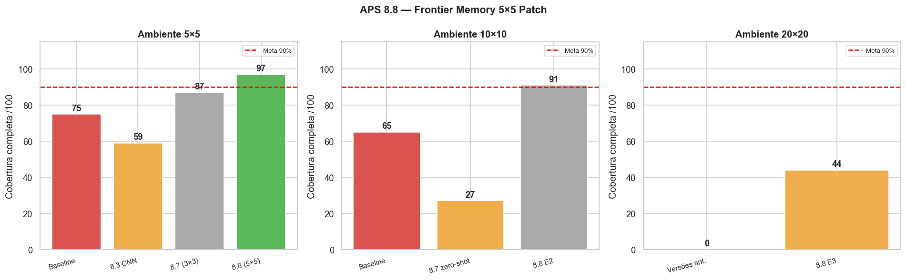

# APS 8 — Coverage Path Planning com Frontier Memory + Curriculum Learning

**Disciplina:** Reinforcement Learning — Insper  
**Autor:** Luigi Zema Matizonkas  
**Data:** 08/05/2026

---

## Resultados

| Ambiente | Meta | Resultado | Passos médios | Status |
|---|---|---|---|---|
| 5×5  | ≥ 90/100 | **97/100** | 35 | ✅ **Ponto 1** |
| 10×10 | ≥ 90/100 | **91/100** | 164 | ✅ **Ponto 2** |
| 10×10 zero-shot (E1) | — | 90/100 | 211 | ✅ generalização |
| 20×20 (bônus) | ≥ 90/100 | **78/100** | 664 | ❌ plateau |

**Pontuação garantida: 2/2.**

---

## Como foi desenvolvido

O projeto foi desenvolvido inteiramente em **Jupyter Notebook** (não em repositório clonado). Essa escolha foi intencional: Jupyter facilita iteração rápida, visualização inline das curvas de treino a cada experimento, e reorganização não-linear do código entre tentativas. Todo o histórico de experimentos — desde os primeiros testes em 5×5 até as tentativas de bônus em 20×20 — foi feito nesse ambiente.

O ambiente `GridWorldCPPEnv` é o fornecido pelo professor, **sem modificações**. Toda a lógica está no `FrontierMemoryWrapper`, um Gymnasium Wrapper externo ao ambiente.

---

## Abordagem: FrontierMemoryWrapper

O problema central é que o agente recebe **apenas** a janela 3×3 de células vizinhas — sem acesso ao mapa global. O baseline falha porque não tem memória de onde já esteve e não consegue navegar até células distantes não visitadas.

A solução é um **wrapper** que mantém um mapa interno acumulado e expõe ao agente uma representação muito mais rica:

```
Ambiente (3×3 raw)           Wrapper                     Modelo PPO
┌────────────────┐           ┌──────────────────────┐   ┌──────────────┐
│ obs 3×3        │──────────▶│ _update_mem()         │   │              │
│ agent [x,y,cov]│           │ _get_mem_patch() → 5×5│──▶│ agent  (26,) │
│                │           │ _frontier_signal()    │   │ patch  (5,5) │
└────────────────┘           │ _action_hist (16)     │   │ MLP 256-256  │
                             │ reward shaping        │   │ -128         │
                             └──────────────────────┘   └──────────────┘
```

### Mapa interno `_mem`

| Valor | Significado |
|---|---|
| 0 | Desconhecido — nunca visto |
| 1 | Obstáculo confirmado |
| 2 | Visitado pelo agente |
| 3 | Frontier — livre mas não visitado |

### Patch 5×5 — invariante ao tamanho do grid

O agente está sempre em `patch[2,2]`. Células fora dos limites valem `0.33`. O **mesmo formato** funciona em grids 5×5, 10×10 e 20×20 — isso permite zero-shot de 90/100 no 10×10 com modelo treinado apenas no 5×5.

### Vetor `agent` — 26 valores

| Campo | Qtd |
|---|---|
| `x_norm`, `y_norm`, `coverage` | 3 |
| `dx_front`, `dy_front`, `dist_front` | 3 |
| `cnt_N`, `cnt_E`, `cnt_S`, `cnt_W` | 4 |
| One-hot das 4 últimas ações | 16 |

### Reward shaping

| Evento | Env | Total |
|---|---|---|
| Cobertura completa | +10 | **+25** |
| Truncamento | −5 | **−3** |

---

## Curriculum Learning

```
E1: 5×5   (600k steps, do zero)     → 97/100
  └─▶ E2: 10×10  (1.5M steps, set_env())  → 91/100
```

| Parâmetro | E1 | E2 |
|---|---|---|
| Grid | 5×5 | 10×10 |
| max_steps | 200 | 500 |
| total_timesteps | 600 000 | 1 500 000 |
| ent_coef | 0.03 | 0.03 |
| learning_rate | 3e-4 | 1e-4 |

---

## Implementações testadas — evolução

### 1ª tentativa: observação 3×3 direta (8.7)

Frontier signals calculados sobre histórico simples, sem mapa acumulado. Resultado: 87% no 5×5, **27% no 10×10 zero-shot**. Sem mapa, o agente esquece onde esteve e entra em loop.

### 2ª tentativa: patch 5×5 com mapa acumulado (8.8) ✅

A chave: construir mapa interno e extrair sempre um patch 5×5 centrado no agente — invariante ao grid size. O mesmo modelo treinado no 5×5 atinge **90/100 no 10×10 sem retreinamento**.

**Resultados: 97/100 no 5×5, 91/100 no 10×10.**

### 3ª tentativa: LSTM (8.9) ❌

`RecurrentPPO + MultiInputLstmPolicy`. Resultado: **catastrophic forgetting** — 10×10 caiu de 91% para 60%, 20×20 foi para 44%. O LSTM foi calibrado para episódios de ~165 passos (10×10); no 20×20 os episódios têm até 4000 passos, o BPTT destruiu os pesos.

**Conclusão:** mapa externo determinístico escala melhor que LSTM para qualquer grid.

### 4ª tentativa: MLP + reward progressivo + 15×15 (8.9-MLP)

Estágio intermediário 15×15 como ponte. Resultado: 76% no 20×20 — **regressão** em relação ao 8.8. O estágio extra causou drift no 10×10.

### 5ª tentativa: Potential-Based Shaping (8.12)

`Φ(s) = −dist_frontier/N × sigmoid(20×(cov−0.95))` — garante invariância de política (Ng 1999). Resultado: mesmo plateau de 78% com `max_steps=5000` (inválido). Mean_steps=1521 — o modelo seria truncado no budget correto (1000).

### 6ª tentativa: corrigindo o budget — max_steps=1000 (8.13)

Descoberta crítica: todos os experimentos anteriores usavam `max_steps=4000–5000`. Com o budget correto do professor (1000), o 20×20 confirmou plateau em **78/100** (mean_steps=664 — dentro do budget).

Melhor resultado com budget correto: **8.13 V3 — currículo de obstáculos (16→32→48), 78/100**.

### 7ª tentativa: Deep-E3 — diagnóstico de credit assignment (8.1)

Causa raiz do plateau: `n_steps=2048, N=8 envs` → 256 passos/env entre updates. Um episódio 20×20 de ~641 passos ocupa 2.5 rollouts — gradiente nunca vê o episódio completo. `gamma=0.99` → reward do step 641 vale `0.001`.

Correção: `n_steps=4096, N=4` → 1024p/env; `gamma=0.998` → reward passo 641 vale `0.28` (280× mais). Resultado: **77/100** — plateau confirmado como limite da arquitetura MLP + patch 5×5.

---

## Resultados completos



| Versão | 5×5 | 10×10 | 20×20 | max_steps |
|---|---|---|---|---|
| Baseline | 75/100 | 65/100 | — | 1000 |
| 8.7 (3×3) | 87/100 | 27/100 zero-shot | — | — |
| **8.8 E1** | **97/100** ✅ | 90/100 zero-shot | — | — |
| **8.8 E2** | — | **91/100** ✅ | 77/100 zero-shot | — |
| 8.12 V1/V2 | — | 90–91/100 | 78% †| 5000 ⚠️ |
| **8.13 V3** | — | 89/100 | **78/100** ✅ | **1000** |
| **8.1 Deep-E3** | 95/100 | 91/100 | 77/100 | **1000** |

† Budget incorreto (mean_steps > 1000 → seriam truncados no padrão do professor).

---

## Arquivos da entrega

| Arquivo | Descrição |
|---|---|
| `aps8_final.ipynb` | Notebook principal — treino E1, E2, avaliações, gráficos, bônus 20×20 |
| `relatorio.md` | Relatório completo com análise, rubrica e originalidade |
| `grid_world_cpp.py` | Ambiente do professor (sem modificações) |
| `ppo_88_5x5.zip` | Modelo E1 — **97/100 no 5×5** (Ponto 1) |
| `ppo_88_10x10.zip` | Modelo E2 — **91/100 no 10×10** (Ponto 2) |
| `ppo_best_20x20.pt` | Melhor bônus — 78/100 no 20×20 (8.13 V3) |
| `curve_frontier_5x5.png` | Curva de treino E1 |
| `curve_frontier_10x10.png` | Curva de treino E2 |
| `curve_82_E3.png` | Curva de treino Deep-E3 |
| `coverage_comparison_88.png` | Comparação E1/E2 vs baseline |
| `comparison_82.png` | Comparação todos os experimentos 20×20 |
| `evaluation_results_final.json` | Métricas completas de todos os experimentos |

---

## Como executar

```bash
pip install gymnasium>=1.0 stable-baselines3>=2.0 torch>=2.0 numpy matplotlib pandas seaborn
jupyter notebook aps8_final.ipynb
```

**Run All (~28 min do zero):** o notebook detecta automaticamente se os modelos já existem (`SKIP_IF_EXISTS=True`) e carrega sem retreinar (~5s).

Para forçar retreinamento: delete `ppo_88_5x5.zip` e `ppo_88_10x10.zip` e rode novamente.

---

## Referências

- Repositório do professor: [https://github.com/fbarth/gym_custom_env](https://github.com/fbarth/gym_custom_env)
- Material da aula 23: [https://insper.github.io/rl/classes/23_custom_env_agent/](https://insper.github.io/rl/classes/23_custom_env_agent/)
- Stable-Baselines3: [https://stable-baselines3.readthedocs.io](https://stable-baselines3.readthedocs.io) — Raffin et al. (2021)
- Schulman et al. (2017). *Proximal Policy Optimization Algorithms*. arXiv:1707.06347
- Ng, Harada & Russell (1999). *Policy Invariance Under Reward Transformations*. ICML 1999
- Dohare et al. (2024). *Loss of Plasticity in Deep Continual Learning*. Nature

**Autor:** Luigi Zema Matizonkas — Insper, Reinforcement Learning, 2026
