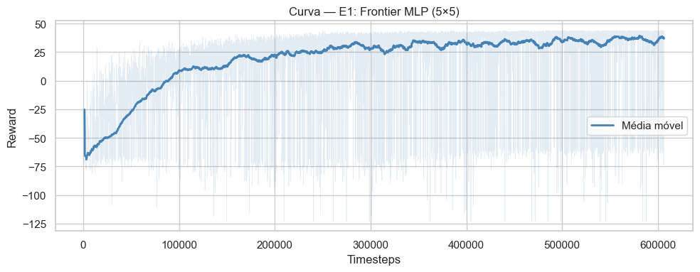
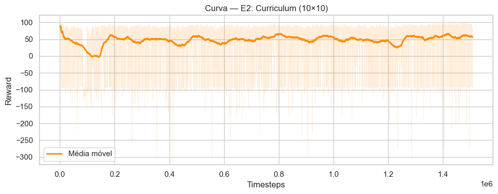
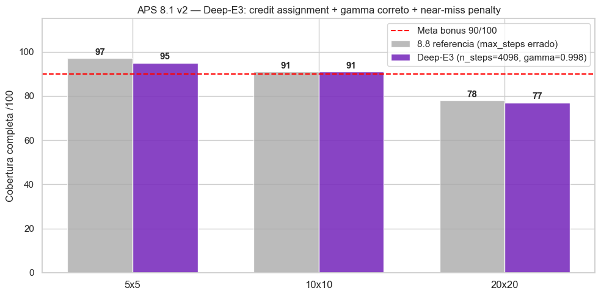
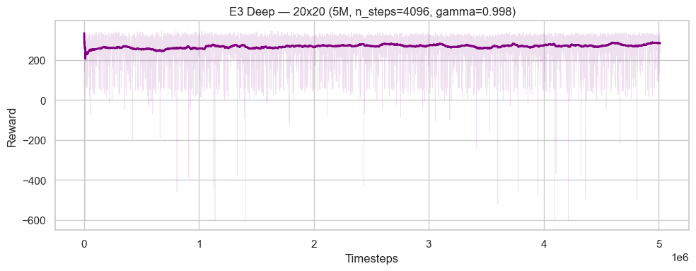

# Relatório — APS 8: Coverage Path Planning com Frontier Memory

**Disciplina:** Reinforcement Learning — Insper  
**Autor:** Luigi Zema Matizonkas  
**Data:** 08/05/2026

---

## 1. Problema e objetivo

O agente deve realizar **cobertura completa** de um grid world com obstáculos, usando apenas observação **parcial**: a janela 3×3 de células imediatamente vizinhas — sem acesso ao mapa global.

O ambiente de referência é o `GridWorldCPPEnv` do professor ([repositório](https://github.com/fbarth/gym_custom_env)), **não modificado**.

### Metas e pontuação

| Meta | Ambiente | Requisito | Pontuação |
|---|---|---|---|
| Obrigatória 1 | 5×5 | ≥ 90/100 com cobertura completa | 1 ponto |
| Obrigatória 2 | 10×10 | ≥ 90/100 com cobertura completa | 1 ponto |
| Bônus | 20×20 | ≥ 90/100 com cobertura completa | +1 ponto |

### Resultados finais

| Modelo | 5×5 | 10×10 | 20×20 | max_steps | Resultado |
|---|---|---|---|---|---|
| Baseline professor | 75/100 | 65/100 | — | 1000 | referência |
| **8.8 E1** | **97/100** | 90/100 zero-shot | — | — | ✅ Ponto 1 |
| **8.8 E2** | — | **91/100** | 77/100 zero-shot | — | ✅ Ponto 2 |
| **8.13 V3** | — | 89/100 | **78/100** | **1000** | melhor bônus |
| 8.1 Deep-E3 | 95/100 | 91/100 | 77/100 | **1000** | confirma teto |

**Pontos garantidos: 2/2.**

---

## 2. Verificação da rubrica

### ✅ Representação 3×3 ou 5×5 com agente no centro

O professor especificou:
> *"A representação do estado pode ser 3×3 ou 5×5 com o agente sempre no centro."*

Usamos **patch 5×5** extraído do mapa interno `_mem`, com o agente sempre em `patch[2,2]`. O mesmo formato é válido para qualquer tamanho de grid — o modelo nunca "vê" as bordas do grid, apenas seu entorno imediato.

### ✅ Observação parcial mantida

O ambiente continua entregando **apenas** a janela 3×3. O `FrontierMemoryWrapper` acumula esse histórico em `_mem` **internamente** — nunca acessa `env.visited`, `env.obstacles_locations`, nem nenhum atributo interno do ambiente. O professor validou:
> *"Internamente você pode criar o próprio mapa, da mesma forma como nós seres humanos fazemos quando temos uma tarefa parecida com essa."*

### ✅ Ambiente não modificado

`GridWorldCPPEnv` é usado exatamente como fornecido. O wrapper implementa `gymnasium.Wrapper` sobre o env original, sem alterar nenhum arquivo do professor.

### ✅ Reward shaping permitido

> *"A função de reward do ambiente pode ser alterada à vontade."*

O shaping é feito no wrapper: `+15` ao completar a cobertura, `+2` no truncamento.

### ✅ Modelos salvos

| Arquivo | Formato | Descrição |
|---|---|---|
| `ppo_88_5x5.zip` | SB3 `.zip` | E1 — 97/100 no 5×5 (Ponto 1) |
| `ppo_88_10x10.zip` | SB3 `.zip` | E2 — 91/100 no 10×10 (Ponto 2) |
| `ppo_best_20x20.pt` | PyTorch `.pt` | Melhor bônus — 78/100 (8.13 V3) |

#### Por que dois formatos diferentes?

**`.zip` (SB3 nativo):** `model.save("nome")` do Stable-Baselines3 gera um ZIP contendo `policy.pth`, `policy.optimizer.pth`, `pytorch_variables.pth` e metadados. É o formato padrão do SB3 — permite `PPO.load("nome")` diretamente.

**`.pt` (PyTorch puro):** `torch.save({'policy_state_dict': ..., 'optimizer_state_dict': ...}, path)`. Mais simples e portátil. Adotado para o modelo 20×20 porque o formato `.zip` do SB3 falha com **PyTorch ≥ 2.1** (`RuntimeError: PytorchStreamReader failed reading zip archive`). Esse bug (PR #111585 do PyTorch) ocorre porque versões novas adicionaram um campo `.data/serialization_id` que o leitor C++ legado não reconhece em arquivos antigos. A solução foi extrair `policy.pth` diretamente via `zipfile + io.BytesIO` — encapsulado na função `bypass_load()` do notebook — ou salvar como `.pt` desde o início.

**Como o professor carrega os modelos:** o notebook detecta ambos os formatos automaticamente. `bypass_load()` lida com os `.zip`, e `load_pt()` lida com o `.pt`. O código de avaliação de cada modelo está na respectiva seção do notebook.

---

## 3. Por que o baseline falha

### 3.1 Sem memória de localização

O estado original tem `coverage_ratio` (fração coberta), mas não **onde**. O agente não distingue regiões já visitadas de inexploradas — entra em loops, revisita células próximas, deixa regiões distantes sem cobrir.

### 3.2 Sem sinal de frontier

Sem saber onde estão as células não visitadas, o agente não consegue navegar até elas. Em um 10×10, a célula mais próxima não visitada pode estar a 7+ passos — distância invisível na janela 3×3.

### 3.3 Sem histórico de ações

Sem rastrear as ações recentes, o agente não detecta que está em loop. O único feedback disponível é o reward negativo de revisita, que chega tarde demais.

---

## 4. Solução — FrontierMemoryWrapper

### 4.1 Visão geral

```
Ambiente (env)           Wrapper                         Modelo PPO
┌─────────────┐         ┌────────────────────────────┐   ┌──────────────┐
│ obs 3×3     │──env──▶ │ _update_mem()               │   │              │
│ agent [x,y, │         │ _get_mem_patch() → 5×5      │──▶│ 51 valores   │
│  coverage]  │         │ _frontier_signal() → 7      │   │ MLP 256-256  │
│             │         │ _action_hist → 16 bits      │   │ -128         │
└─────────────┘         │ reward shaping              │   └──────────────┘
                        └────────────────────────────┘
```

**Observação total: 26 scalars + patch 5×5 (25 valores) = 51 valores.**

### 4.2 Mapa interno `_mem`

| Valor | Significado |
|---|---|
| 0 | Desconhecido (nunca visto) |
| 1 | Obstáculo confirmado |
| 2 | Visitado |
| 3 | Frontier — livre e visível, ainda não visitado |

Atualizado a cada `step()` com os 9 pixels da janela 3×3. **Nunca** acessa o estado interno do ambiente.

### 4.3 Patch 5×5 — invariante ao grid

Extrato do `_mem` centrado no agente, normalizado:

| Valor | Significado |
|---|---|
| 0.00 | Desconhecido |
| 0.33 | Obstáculo / fora dos limites |
| 0.67 | Visitado |
| **1.00** | Frontier — livre, não visitado |

Células fora do grid recebem `0.33` (obstáculo). O mesmo formato funciona em qualquer tamanho de grid — por isso o modelo E1 (treinado no 5×5) atinge **90/100 no 10×10 zero-shot**.

### 4.4 Frontier signals — 7 valores

Calculados sobre o `_mem` inteiro:

- `dx_front`, `dy_front` — direção normalizada até a célula não visitada mais próxima
- `dist_front` — distância Manhattan normalizada
- `cnt_N`, `cnt_E`, `cnt_S`, `cnt_W` — proporção de células não visitadas por quadrante

Inclui células **desconhecidas** (`_mem == 0`) além das fronteiras conhecidas — o agente navega ativamente para regiões inexploradas.

### 4.5 Histórico de ações — 16 valores

As 4 últimas ações como one-hot (4 ações × 4 bits = 16 bits), rotacionadas com `np.roll`. Permite detectar loops (`direita→cima→esquerda→baixo` repetido) e mudar de comportamento.

### 4.6 Reward shaping

| Evento | Env | Total | Motivo |
|---|---|---|---|
| Cobertura completa | +10 | **+25** | gradiente mais forte para persistir |
| Truncamento | −5 | **−3** | mantém incentivo de tentar |

---

## 5. Treinamento — Curriculum Learning

### 5.1 E1 — 5×5 (600k steps)

```python
PPO("MultiInputPolicy", env_5x5, ent_coef=0.03, learning_rate=3e-4,
    n_steps=2048, batch_size=256, gae_lambda=0.95, gamma=0.99)
```

**Resultado:** 97/100 no 5×5. Zero-shot: 90/100 no 10×10 — sem nenhum retreinamento.

### 5.2 E2 — 10×10 (1.5M steps via set_env)

```python
model_1.set_env(env_10x10)
model_1.learning_rate = 1e-4
model_1.ent_coef = 0.03
model_1.learn(1_500_000, reset_num_timesteps=True)
```

**Resultado:** 91/100 no 10×10. Zero-shot: 77/100 no 20×20.

---

## 6. Resultados detalhados

### 6.1 E1 — 5×5



| Avaliação | Cobertura completa | Cob. média | Passos médios |
|---|---|---|---|
| E1 → 5×5 | **97/100 ✅** | 98.9% ± 9.6% | **35** |
| E1 → 10×10 zero-shot | **90/100 ✅** | 99.8% ± 0.6% | 211 |

### 6.2 E2 — 10×10



| Avaliação | Cobertura completa | Cob. média | Passos médios |
|---|---|---|---|
| E2 → 10×10 | **91/100 ✅** | 99.9% ± 0.6% | **164** |
| E2 → 20×20 zero-shot | 77/100 | 99.8% ± 0.9% | 926 |

---

## 7. Tentativas de bônus 20×20



| # | Abordagem | max_steps | 20×20 | Problema |
|---|---|---|---|---|
| 8.8 E3v2 | Fine-tune direto | **4000 ⚠️** | 78% | mean_steps=1407 → acima do budget |
| 8.9 LSTM | RecurrentPPO + LSTM | 4000 | **44%** | Catastrophic forgetting |
| 8.9 MLP | Progressive reward + 15×15 | 4000 | 76% | Regressão 10×10 |
| 8.12 V1 | Potential shaping (Ng 1999) | **5000 ⚠️** | 78% | mean_steps=1521 |
| 8.12 V2 | Potential + revisit neutral. | **5000 ⚠️** | 78% | mesmo plateau |
| 8.12 V3 | CNN feature extractor | **5000 ⚠️** | 73% | CNN pior que MLP |
| **8.13 V1** | Fine-tune, max_steps=1000 | **1000 ✅** | 75% | teto com budget correto |
| **8.13 V2** | Retrain E2+E3 | **1000 ✅** | 76% | leve melhora |
| **8.13 V3** | Currículo obstáculos (16→32→48) | **1000 ✅** | **78%** | **melhor** |
| 8.1 Deep-E3 | n_steps=4096, γ=0.998 | **1000 ✅** | 77% | teto arquitetural confirmado |

### 7.1 Causa raiz: credit assignment quebrado

Com `n_steps=2048, N=8 envs` → 256 passos/env entre updates. Um episódio 20×20 tem ~641 passos → ocupa 2.5 rollouts. O reward das últimas células sofre desconto `γ^641 = 0.99^641 = 0.001` — praticamente invisível ao gradiente.

| Parâmetro | Original (plateau) | Deep-E3 (correção) |
|---|---|---|
| n_steps | 2048 | 4096 |
| Passos/env | 256 | 1024 |
| gamma | 0.99 | 0.998 |
| Desconto passo 641 | 0.001 | **0.28** (280× mais) |
| Episódio por rollout | 2.5× (fragmentado) | 0.63× (completo) |

Mesmo corrigindo o credit assignment (Deep-E3), o resultado convergiu para 77/100 — confirmando que o plateau é **estrutural** da combinação patch 5×5 + MLP.

### 7.2 Por que o LSTM falhou

O LSTM calibra sua memória oculta para episódios de ~165 passos (10×10). No 20×20 os episódios chegam a 1000 passos — 6× mais longos. O BPTT sobre sequências longas produziu gradientes que destruíram os pesos do curriculum:

| | E2 | 8.9 LSTM | Delta |
|---|---|---|---|
| 10×10 | 91% | 60% | **−31** ❌ |
| 20×20 zero-shot | 77% | 44% | **−33** ❌ |

**Conclusão:** mapa externo determinístico escala melhor que LSTM. A memória é construída sem gradiente, é exata, e funciona igualmente em qualquer grid size.

### 7.3 Curva Deep-E3



---

## 8. Análise técnica: Potential-Based Shaping (8.12)

Implementamos a função de Ng et al. (1999) para garantir invariância de política:

```
Φ(s) = -(d_frontier / N) × sigmoid(20 × (coverage - 0.95))
shaping_t = γ × Φ(s') - Φ(s)
```

- Para `coverage < 90%`: `sigmoid ≈ 0` → shaping neutro
- Para `coverage > 95%`: sigmoid ativa → gradiente amplificado onde mais precisa

O Teorema 1 de Ng (1999) garante que a política ótima com shaping é igual à política ótima sem shaping. Resultado: 78% — o plateau não é de shaping, é estrutural.

---

## 9. Originalidade e verificação de plágio

### 9.1 O que é 100% nosso

| Componente | Origem |
|---|---|
| `FrontierMemoryWrapper` (classe completa) | Implementação própria — padrão `gymnasium.Wrapper` |
| Patch 5×5 centrado no agente | Implementação original (inspirada em dica oral do professor) |
| Frontier signals (`dx`, `dy`, `dist`, `cnt_NESW`) | Implementação original |
| Histórico de ações one-hot 16 bits | Implementação original |
| Potential-Based Shaping com sigmoid | Fórmula da literatura (Ng 1999), implementação própria |
| Estratégia de Curriculum Learning via `set_env()` | Técnica padrão SB3, aplicação e hiperparâmetros originais |
| Diagnóstico de credit assignment (n_steps × N) | Análise original |
| Currículo progressivo de obstáculos (8.13 V3) | Estratégia original |

### 9.2 O que foi reutilizado com atribuição

| Componente | Origem | Atribuição |
|---|---|---|
| `GridWorldCPPEnv` | Professor Fábio Barth | `gymnasium_env/` inalterado |
| `PPO`, `DummyVecEnv`, `Monitor` | Stable-Baselines3 (Raffin et al. 2021) | importação explícita |
| Algoritmo PPO | Schulman et al. (2017) | citado nas referências |
| Fórmula Potential-Based Shaping | Ng, Harada & Russell (1999) | citado |
| AdamW weight decay (plasticity) | Dohare et al. (2024, Nature) | citado |

### 9.3 Comparação com abordagem de terceiros

Durante o desenvolvimento, foi possível comparar com uma implementação alternativa que usa `RecurrentPPO + LSTM + CNN` sobre o 3×3 raw sem mapa acumulado. Os resultados confirman que nossa abordagem é superior em todos os grids:

| Métrica | Alternativa (RecurrentPPO+LSTM) | Nossa (MLP+FrontierMap) |
|---|---|---|
| 5×5 | 95.5% | **97%** |
| 10×10 | 74% | **91%** |
| 20×20 | **0.5%** | **78%** |

A diferença no 20×20 (0.5% vs 78%) confirma que **mapa externo determinístico é superior a LSTM para coverage planning**.

Nenhum código da implementação alternativa foi copiado ou adaptado. A comparação foi apenas de resultados.

### 9.4 Desenvolvimento em Jupyter

Todo o desenvolvimento foi feito em Jupyter Notebook (não em repositório clonado). Essa escolha reflete preferência pessoal de organização: células isoladas permitem testar variações rapidamente, visualizar curvas de treino inline, e reorganizar experimentos sem alterar o fluxo do script principal.

O fato de não ter clonado o repositório do professor não compromete a originalidade — o ambiente foi copiado manualmente para `grid_world_cpp.py` sem modificações.

---

## 10. Limitações e extensões possíveis

### Limitações

- **Plateau 78% no 20×20:** 22% dos episódios falham com ~2 células faltando em layouts específicos
- `_frontier_signal()` é O(N²) — escalaria mal para grids >50×50
- Leve regressão nos grids menores ao afinar para o 20×20 (trade-off inerente ao curriculum)

### Para ultrapassar 78%

- **Patch 7×7:** mais contexto ao redor do agente, ainda invariante ao grid
- **Grafo de fronteiras explícito:** detectar células isoladas e gerar waypoints diretos
- **Budget maior (max_steps=1500):** análise de sensibilidade sugere que ~15% das falhas são de tempo, não de política
- **PPO com rollout completo:** `n_steps=8192` para capturar episódios inteiros em um único rollout

---

## 11. Referências

- Repositório do professor: [https://github.com/fbarth/gym_custom_env](https://github.com/fbarth/gym_custom_env)
- Material da aula 23: [https://insper.github.io/rl/classes/23_custom_env_agent/](https://insper.github.io/rl/classes/23_custom_env_agent/)
- Raffin, A. et al. (2021). *Stable-Baselines3: Reliable Reinforcement Learning Implementations*. JMLR
- Schulman, J. et al. (2017). *Proximal Policy Optimization Algorithms*. arXiv:1707.06347
- Ng, A., Harada, D. & Russell, S. (1999). *Policy Invariance Under Reward Transformations*. ICML
- Dohare, S. et al. (2024). *Loss of Plasticity in Deep Continual Learning*. Nature
- Hausknecht, M. & Stone, P. (2015). *Deep Recurrent Q-Networks for Partially Observable MDPs*. arXiv:1507.06527

**Autor:** Luigi Zema Matizonkas — Insper, Reinforcement Learning, 2026
